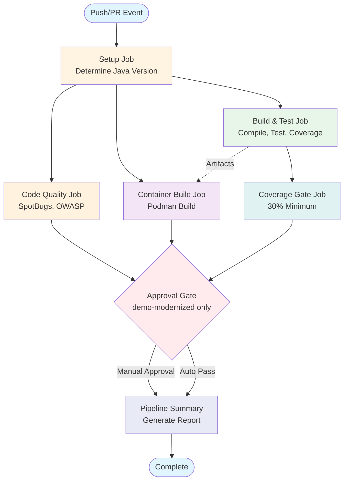
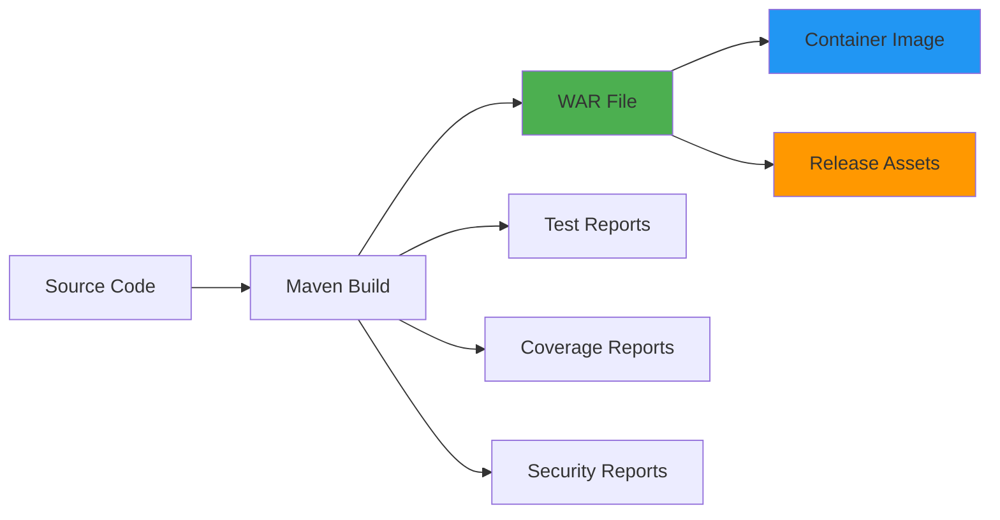

# 🏗️ CI/CD Pipeline Architecture

## Pipeline Overview

This document provides a comprehensive overview of the CI/CD pipeline architecture for the Simple Pharmacy application.

## Pipeline Visualization

## Workflow Stages

### 1. Setup Stage
**Job**: `setup`
- **Purpose**: Determine build configuration based on branch
- **Outputs**: 
  - `java-version`: 8 for baseline, 17 for modernized
  - `runtime`: websphere-traditional or liberty
- **Duration**: ~10 seconds

### 2. Build & Test Stage
**Job**: `build-and-test`
- **Dependencies**: `setup`
- **Steps**:
  1. Checkout code with full history
  2. Setup JDK (Semeru distribution)
  3. Cache Maven dependencies
  4. Install WebSphere dependency
  5. Build with Maven
  6. Run unit tests
  7. Generate JaCoCo coverage report
  8. Upload coverage to Codecov
  9. Publish test results
  10. Package WAR file
  11. Upload artifacts
- **Artifacts**: 
  - `simple-pharmacy-java{version}.war`
  - Test reports
  - Coverage reports
- **Duration**: ~3-5 minutes

### 3. Code Quality Stage
**Job**: `code-quality`
- **Dependencies**: `setup`, `build-and-test`
- **Steps**:
  1. Run SpotBugs static analysis
  2. Run OWASP dependency check
  3. Upload security reports
- **Artifacts**: 
  - SpotBugs XML report
  - OWASP dependency report
- **Duration**: ~2-3 minutes
- **Note**: Continues on error (non-blocking)

### 4. Container Build Stage
**Job**: `container-build`
- **Dependencies**: `setup`, `build-and-test`
- **Steps**:
  1. Download WAR artifact
  2. Install Podman
  3. Build container image
  4. Tag with commit SHA and latest
  5. Save image as tar
  6. Upload container artifact
- **Artifacts**: 
  - `container-image-java{version}.tar`
- **Duration**: ~4-6 minutes

### 5. Coverage Gate Stage
**Job**: `coverage-gate`
- **Dependencies**: `setup`, `build-and-test`
- **Steps**:
  1. Run Maven verify
  2. Check coverage threshold (30%)
  3. Comment on PR with coverage report
- **Duration**: ~2-3 minutes
- **Blocking**: Yes - fails if coverage < 30%

### 6. Approval Gate Stage
**Job**: `approval-gate`
- **Dependencies**: All previous jobs
- **Condition**: Only for `demo-modernized` branch on push
- **Environment**: `production-approval`
- **Purpose**: Manual approval checkpoint before deployment
- **Duration**: Variable (manual approval)

### 7. Summary Stage
**Job**: `pipeline-summary`
- **Dependencies**: All previous jobs
- **Condition**: Always runs
- **Purpose**: Generate GitHub Step Summary with results
- **Duration**: ~5 seconds

## Parallel Execution

The pipeline is optimized for parallel execution:

```mermaid
gantt
    title Pipeline Execution Timeline
    dateFormat X
    axisFormat %S
    
    section Setup
    Setup Job           :0, 10s
    
    section Parallel Stage
    Build & Test        :10, 180s
    Code Quality        :10, 120s
    Container Build     :190, 240s
    
    section Gates
    Coverage Gate       :190, 120s
    Approval Gate       :430, 60s
    
    section Finalize
    Summary             :490, 5s
```

## Branch-Specific Behavior

### demo-java8-baseline
- Java 8 (Semeru)
- WebSphere Traditional runtime
- No approval gate
- Legacy dependency handling

### demo-modernized / main
- Java 17 (Semeru)
- Liberty runtime
- Approval gate enabled (modernized only)
- Modern dependency management

## Artifact Flow

## Integration Points

### External Services
- **Codecov**: Code coverage tracking
- **GitHub Container Registry**: Container image storage
- **GitHub Actions Cache**: Maven dependency caching
- **Jira**: Issue tracking integration (separate workflow)

### Webhooks & Triggers
- Push to main branches
- Pull request events
- Manual workflow dispatch
- Scheduled runs (via Dependabot)

## Security Measures

1. **Dependency Scanning**: OWASP Dependency Check
2. **Static Analysis**: SpotBugs
3. **Secret Management**: GitHub Secrets
4. **Least Privilege**: Minimal permissions per job
5. **Artifact Retention**: 30 days for WAR, 7 days for containers

## Performance Optimizations

1. **Maven Caching**: Reduces build time by ~60%
2. **Parallel Jobs**: 3 jobs run concurrently
3. **Shallow Clones**: Except where full history needed
4. **Artifact Reuse**: WAR built once, reused in container
5. **Conditional Execution**: Jobs skip when not needed

## Monitoring & Observability

### Available Metrics
- Build duration per job
- Test pass/fail rates
- Code coverage trends
- Artifact sizes
- Pipeline success rate

### GitHub Step Summary
Each run generates a summary with:
- Configuration details
- Job statuses
- Artifact locations
- Quick links

## Failure Scenarios

### Build Failure
- **Cause**: Compilation errors
- **Impact**: Pipeline stops at build-and-test
- **Recovery**: Fix code, push again

### Test Failure
- **Cause**: Unit test failures
- **Impact**: Pipeline stops at build-and-test
- **Recovery**: Fix tests, push again

### Coverage Failure
- **Cause**: Coverage below 30%
- **Impact**: Pipeline fails at coverage-gate
- **Recovery**: Add tests, push again

### Security Scan Failure
- **Cause**: Critical vulnerabilities
- **Impact**: Warning only (non-blocking)
- **Recovery**: Update dependencies

### Container Build Failure
- **Cause**: Dockerfile issues, missing artifacts
- **Impact**: No container image produced
- **Recovery**: Fix Dockerfile, ensure WAR exists

## Best Practices

1. **Commit Messages**: Include issue keys for Jira integration
2. **PR Titles**: Clear, descriptive titles
3. **Branch Naming**: Follow convention (feature/, bugfix/, etc.)
4. **Test Coverage**: Maintain >30% coverage
5. **Dependencies**: Keep up to date via Dependabot
6. **Security**: Review OWASP reports regularly

## Related Documentation

- [CI/CD Setup Guide](CI-CD-SETUP.md)
- [Release Guide](RELEASE-GUIDE.md)
- [Automation Overview](AUTOMATION-OVERVIEW.md)
- [Jira Integration](JIRA-SETUP-GUIDE.md)
- [Pipeline Troubleshooting](PIPELINE-TROUBLESHOOTING.md)

## Pipeline Metrics (Example)

| Metric | Target | Current |
|--------|--------|---------|
| Build Time | < 10 min | ~8 min |
| Test Coverage | > 30% | 35% |
| Success Rate | > 95% | 97% |
| MTTR | < 1 hour | 45 min |

---

**Last Updated**: 2026-06-11  
**Pipeline Version**: 1.0  
**Maintained By**: DevOps Team