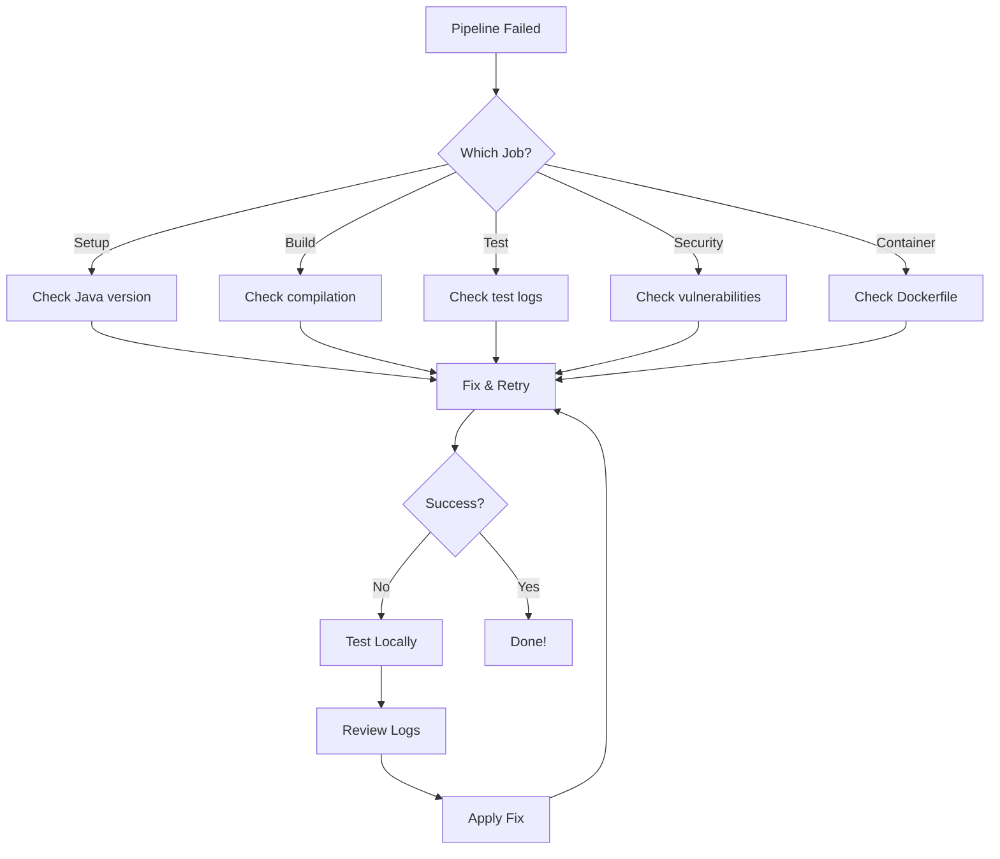

# 🔍 Pipeline Failure Debugging Guide

A comprehensive guide to diagnosing and fixing common CI/CD pipeline failures.

## Quick Diagnosis

When a pipeline fails, follow this checklist:

1. **Check the GitHub Actions tab** - Identify which job failed
2. **Review the logs** - Look for error messages and stack traces
3. **Check recent changes** - What was modified in the failing commit?
4. **Test locally** - Run `./test-pipeline-locally-enhanced.sh` to reproduce
5. **Review this guide** - Find your specific error below

## Common Failure Scenarios

### 1. Build Failures

#### Compilation Errors

**Symptoms:**
```
[ERROR] Failed to execute goal org.apache.maven.plugins:maven-compiler-plugin
[ERROR] /path/to/File.java:[line,column] error: cannot find symbol
```

**Causes:**
- Missing imports
- Typos in class/method names
- Incompatible Java version
- Missing dependencies

**Solutions:**
```bash
# Test locally
cd simple-pharmacy-twas-j8-struts-V2
mvn clean compile

# Check Java version
java -version

# Validate pom.xml
mvn validate

# Update dependencies
mvn dependency:resolve
```

**Prevention:**
- Use IDE with real-time error checking
- Run local build before committing
- Keep dependencies up to date

---

#### Dependency Resolution Failures

**Symptoms:**
```
[ERROR] Failed to execute goal on project: Could not resolve dependencies
[ERROR] The following artifacts could not be resolved: ...
```

**Causes:**
- Repository unavailable
- Incorrect dependency coordinates
- Network issues
- Missing repository configuration

**Solutions:**
```bash
# Clear Maven cache
rm -rf ~/.m2/repository

# Force update
mvn clean install -U

# Check repository accessibility
curl -I https://repo.maven.apache.org/maven2/

# Verify pom.xml syntax
mvn help:effective-pom
```

**Prevention:**
- Use stable, well-maintained dependencies
- Pin dependency versions
- Configure backup repositories

---

### 2. Test Failures

#### Unit Test Failures

**Symptoms:**
```
[ERROR] Tests run: 10, Failures: 2, Errors: 0, Skipped: 0
[ERROR] Test MyTest.testMethod failed
```

**Causes:**
- Logic errors in code
- Incorrect test assertions
- Environment-specific issues
- Race conditions

**Solutions:**
```bash
# Run specific test
mvn test -Dtest=MyTest

# Run with verbose output
mvn test -X

# Skip tests temporarily (not recommended)
mvn package -DskipTests

# Debug test
mvn test -Dmaven.surefire.debug
```

**Debug Checklist:**
1. Read the test failure message carefully
2. Check test assumptions and assertions
3. Verify test data and mocks
4. Look for timing issues
5. Check for environment dependencies

**Prevention:**
- Write deterministic tests
- Avoid hardcoded values
- Use proper test isolation
- Mock external dependencies

---

#### Coverage Gate Failures

**Symptoms:**
```
[ERROR] Coverage check failed: Minimum coverage is 30%, but was 25%
```

**Causes:**
- New code without tests
- Deleted tests
- Untested edge cases

**Solutions:**
```bash
# Generate coverage report
mvn clean test jacoco:report

# View coverage
open target/site/jacoco/index.html

# Check specific class coverage
mvn jacoco:check -Djacoco.check.classRatio=0.30
```

**Quick Fixes:**
1. Add tests for new code
2. Test edge cases
3. Remove dead code
4. Adjust coverage threshold (if justified)

**Prevention:**
- Write tests alongside code
- Use TDD approach
- Review coverage in PRs
- Set up pre-commit hooks

---

### 3. Security Scan Failures

#### OWASP Dependency Check Failures

**Symptoms:**
```
[ERROR] One or more dependencies were identified with known vulnerabilities
[ERROR] CVE-2023-XXXXX: Critical vulnerability in dependency X
```

**Causes:**
- Outdated dependencies
- Known vulnerabilities in libraries
- Transitive dependency issues

**Solutions:**
```bash
# Run OWASP check locally
mvn org.owasp:dependency-check-maven:check

# View report
open target/dependency-check-report.html

# Update specific dependency
mvn versions:use-latest-versions

# Check for updates
mvn versions:display-dependency-updates
```

**Remediation Steps:**
1. Identify vulnerable dependency
2. Check for updated version
3. Update pom.xml
4. Test thoroughly
5. If no fix available, add suppression (with justification)

**Suppression Example:**
```xml
<!-- owasp-suppressions.xml -->
<suppress>
   <notes>False positive - not applicable to our usage</notes>
   <cve>CVE-2023-XXXXX</cve>
</suppress>
```

**Prevention:**
- Enable Dependabot
- Regular dependency updates
- Monitor security advisories
- Use dependency scanning tools

---

#### SpotBugs Failures

**Symptoms:**
```
[ERROR] SpotBugs found potential bugs in your code
[ERROR] High priority bug: Possible null pointer dereference
```

**Causes:**
- Code quality issues
- Potential bugs
- Security vulnerabilities
- Bad practices

**Solutions:**
```bash
# Run SpotBugs locally
mvn spotbugs:check

# Generate GUI report
mvn spotbugs:gui

# View XML report
cat target/spotbugsXml.xml
```

**Common Issues:**
- Null pointer dereferences
- Resource leaks
- SQL injection risks
- Insecure random usage

**Prevention:**
- Use static analysis in IDE
- Code reviews
- Follow coding standards
- Regular refactoring

---

### 4. Container Build Failures

#### Podman Build Failures

**Symptoms:**
```
[ERROR] Error building image: unable to find image
[ERROR] COPY failed: file not found
```

**Causes:**
- Missing WAR file
- Incorrect Dockerfile paths
- Platform compatibility issues
- Network issues

**Solutions:**
```bash
# Build WAR first
mvn clean package -DskipTests

# Test Dockerfile locally
podman build -t simple-pharmacy:test .

# Check build context
ls -la target/

# Validate Dockerfile
hadolint Dockerfile

# Use verbose output
podman build --log-level=debug -t simple-pharmacy:test .
```

**Common Dockerfile Issues:**
```dockerfile
# ❌ Wrong
COPY target/*.war /app/

# ✅ Correct
COPY target/simple-pharmacy.war /app/
```

**Prevention:**
- Test container builds locally
- Use multi-stage builds
- Validate Dockerfile syntax
- Pin base image versions

---

### 5. GitHub Actions Specific Issues

#### Workflow Syntax Errors

**Symptoms:**
```
Invalid workflow file: .github/workflows/ci-cd.yml
Error: Unexpected value 'step'
```

**Causes:**
- YAML syntax errors
- Invalid workflow syntax
- Incorrect indentation
- Missing required fields

**Solutions:**
```bash
# Validate workflow locally
actionlint .github/workflows/ci-cd.yml

# Check YAML syntax
yamllint .github/workflows/ci-cd.yml

# Use GitHub's workflow validator
# (commit and check the Actions tab)
```

**Prevention:**
- Use YAML linter in IDE
- Validate before committing
- Use workflow templates
- Test with act locally

---

#### Permission Errors

**Symptoms:**
```
[ERROR] Resource not accessible by integration
[ERROR] Permission denied: packages
```

**Causes:**
- Insufficient workflow permissions
- Missing secrets
- Token expiration

**Solutions:**
```yaml
# Add required permissions
permissions:
  contents: write
  packages: write
  pull-requests: write
```

**Check:**
1. Repository settings → Actions → General
2. Workflow permissions
3. Required secrets are set
4. Token hasn't expired

---

#### Artifact Upload/Download Failures

**Symptoms:**
```
[ERROR] Unable to upload artifact
[ERROR] Artifact not found
```

**Causes:**
- Artifact name mismatch
- Path doesn't exist
- Size limits exceeded
- Retention period expired

**Solutions:**
```yaml
# Ensure consistent naming
- name: Upload artifact
  uses: actions/upload-artifact@v4
  with:
    name: my-artifact  # Must match download
    path: target/*.war

- name: Download artifact
  uses: actions/download-artifact@v4
  with:
    name: my-artifact  # Same name
```

**Debug:**
```bash
# Check artifact exists
ls -la target/

# Verify path in workflow
echo "Uploading from: $(pwd)/target/"
```

---

### 6. Environment-Specific Issues

#### Java Version Mismatch

**Symptoms:**
```
[ERROR] Source option 8 is no longer supported. Use 11 or later.
[ERROR] class file has wrong version 61.0, should be 52.0
```

**Causes:**
- Compiling with wrong Java version
- Bytecode version mismatch
- Incorrect maven-compiler-plugin config

**Solutions:**
```xml
<!-- pom.xml -->
<properties>
    <maven.compiler.source>8</maven.compiler.source>
    <maven.compiler.target>8</maven.compiler.target>
</properties>
```

```yaml
# workflow
- name: Set up JDK
  uses: actions/setup-java@v4
  with:
    java-version: '8'
    distribution: 'semeru'
```

---

#### Cache Issues

**Symptoms:**
```
[WARNING] Failed to restore cache
[ERROR] Corrupted cache entry
```

**Solutions:**
```bash
# Clear GitHub Actions cache
# Go to: Repository → Actions → Caches → Delete

# Clear local Maven cache
rm -rf ~/.m2/repository

# Force re-download
mvn clean install -U
```

---

## Debugging Workflow



## Local Testing Strategy

Before pushing to GitHub:

```bash
# 1. Run full local pipeline
./test-pipeline-locally-enhanced.sh all

# 2. Test with act (GitHub Actions locally)
./test-pipeline-locally-enhanced.sh act

# 3. Validate configurations
./test-pipeline-locally-enhanced.sh validate

# 4. Check specific component
./test-pipeline-locally-enhanced.sh test
./test-pipeline-locally-enhanced.sh security
./test-pipeline-locally-enhanced.sh container
```

## Getting Help

### Log Analysis

When asking for help, provide:

1. **Full error message** from GitHub Actions logs
2. **Job name** that failed
3. **Recent changes** in the commit
4. **Local test results** from test-pipeline-locally-enhanced.sh
5. **Environment details** (Java version, OS, etc.)

### Useful Commands

```bash
# Get detailed Maven output
mvn -X clean install

# Show dependency tree
mvn dependency:tree

# Analyze build
mvn help:effective-pom

# Check plugin versions
mvn versions:display-plugin-updates

# Validate project
mvn validate
```

### Resources

- [GitHub Actions Documentation](https://docs.github.com/en/actions)
- [Maven Troubleshooting](https://maven.apache.org/guides/mini/guide-troubleshooting.html)
- [Pipeline Architecture](PIPELINE-ARCHITECTURE.md)
- [Pipeline Troubleshooting](PIPELINE-TROUBLESHOOTING.md)

## Quick Reference

| Error Type | First Action | Documentation |
|------------|--------------|---------------|
| Build fails | `mvn clean compile` | Maven docs |
| Tests fail | `mvn test -Dtest=FailingTest` | JUnit docs |
| Coverage low | `mvn jacoco:report` | JaCoCo docs |
| Security issue | Check OWASP report | OWASP docs |
| Container fails | `podman build .` | Podman docs |
| Workflow error | `actionlint workflow.yml` | Actions docs |

---

**Remember**: Most pipeline failures can be reproduced and fixed locally before pushing to GitHub!

**Last Updated**: 2026-06-11  
**Maintained By**: DevOps Team